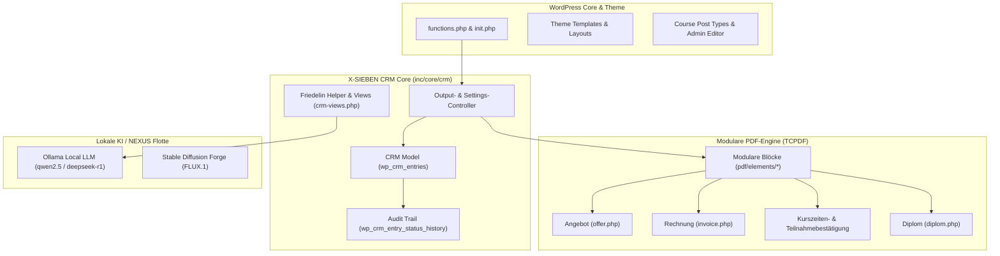

# X-SIEBEN WordPress Theme (`sieben`)

[](file:///home/roland/Documents/x-sieben/wp-content/themes/sieben/style.css)
[](file:///home/roland/Documents/x-sieben/wp-content/themes/sieben/inc/core/crm)
[](file:///home/roland/Documents/x-sieben/wp-content/themes/sieben/inc/core/crm/GEMINI.md)
[](file:///home/roland/Documents/x-sieben/wp-content/themes/sieben/license.txt)

Modernes, performantes und hochgradig anpassbares WordPress-Theme für **X-SIEBEN** mit vollständig integriertem, nativem **CRM- & Seminar-Management-System**.

---

## 🌟 Übersicht & Highlights

Das Theme **Sieben** vereint ein responsives Kurs- und Redaktionsportal mit einer autarken CRM- und Dokumenten-Engine:

* **Kurs- & Seminar-Management:** Maßgeschneiderte Custom Post Types für Kurse, Termine, Standorte und Trainer.
* **Integriertes CRM-System (`inc/core/crm`):** Vollständiges Lead-, Buchungs- und Teilnehmer-Management direkt im WordPress-Backend.
* **Modulare PDF-Engine (TCPDF):** Generierung rechts- und normkonformer Dokumente (Angebote, Rechnungen, Kurszeiten-, Teilnahme- und Diplom-Bestätigungen).
* **Automatisierte E-Mail-Workflows:** 7 definierte Status-E-Mails mit HTML5-Normalisierung und Cicero-geprüfter Tonalität (Österreich-Standard).
* **NEXUS & Friedelin AI-Integration:** Nahtlose Anbindung an lokale LLMs (Qwen 2.5, DeepSeek R1) für datenschutzkonforme Textoptimierung und Assistenz.
* **Rechtliche & Steuerliche Konformität:** Österreichische USt-Standards (20%), ISO 17024, IPMA/pma, AMS-UE und FAGG-Schutz.

---

## 🏗️ Modul-Architektur



---

## 📁 Verzeichnisstruktur

```text
wp-content/themes/sieben/
├── admin/                      # Backend-Verwaltung & Kurs-Editoren
│   └── courses-edit.php        # Kurs- und Termineditor
├── assets/                     # Frontend CSS/JS, Fonts und Icons
├── functions/                  # Komponenten- und Template-Funktionen
│   └── functions-components.php
├── inc/
│   ├── core/
│   │   └── crm/                # ⚡ X-SIEBEN CRM Kernsystem
│   │       ├── assets/         # Standalone Admin-CSS & JS
│   │       ├── controler/      # MVC Controller (Settings, Output)
│   │       ├── helpers/        # Hilfsfunktionen, Presenter & Friedelin-Integration
│   │       ├── pdf/            # PDF-Templates & modulare Sektionen
│   │       │   └── elements/   # Wiederverwendbare PDF-Subkomponenten
│   │       ├── tests/          # Automatisierte SDS-Test-Suite
│   │       └── views/          # CRM Admin-Partials & Settings-Tabs
│   ├── models/                 # Datenmodelle (Course Model etc.)
│   └── init.php                # Theme-Initialisierung
├── style.css                   # Theme-Definition & Metadaten
└── README.md                   # Projektdokumentation
```

---

## 📄 Dokumenten-Engine (PDF-Matrix)

Das CRM generiert hochauflösende, druckfähige Vektor-PDFs über eine komponentenbasierte Architektur:

| Dokument | Template | Beschreibung |
| :--- | :--- | :--- |
| **Angebot** | `pdf/offer.php` | Detailliertes Kundenangebot inkl. Kostengliederung, Lehrgangsinhalten und AGB. |
| **Rechnung** | `pdf/invoice.php` | Finanzamt-konforme Rechnung mit 20% USt-Ausweis und QR-Zahlungscode. |
| **Kurszeitenbestätigung** | `pdf/kurszeitenbestaetigung.php` | Bestätigung über absolvierte Unterrichtseinheiten (z. B. für AMS oder Förderstellen). |
| **Teilnahmebestätigung** | `pdf/teilnamebestaetigung.php` | Offizielle Teilnahmeurkunde mit Lehreinheiten und Siegel. |
| **Diplom** | `pdf/diplom.php` | Offizielles X-SIEBEN Abschlussdiplom mit Beglaubigung und Gütesiegeln. |

---

## 🚀 Deployment

Das Theme wird über ein automatisiertes Deployment-Skript mit dem TimmeHosting-Liveserver synchronisiert:

```bash
# CRM-Änderungen auf Live-Server deployen und Backend-Cache leeren
python3 /home/roland/Documents/x-sieben/deploy_crm_live.py
```

*Das Deployment-Skript schließt lokale Testdateien, Git-Artefakte und temporäre PDFs automatisch aus.*

---

## 👥 Mitwirkende & Copyright

* **Unternehmen:** X-SIEBEN (Inh. Hannes Gajo)
* **Entwicklung & Architektur:** Roland Sauer
* **KI-Assistenz:** Friedelin (X-SIEBEN KI-Assistent by NEXUS)
* **Lizenz:** GNU General Public License v2 or later
